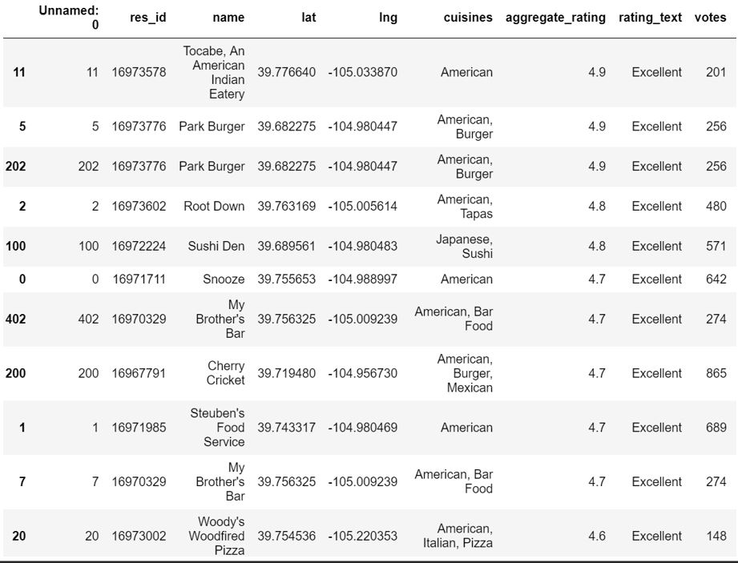
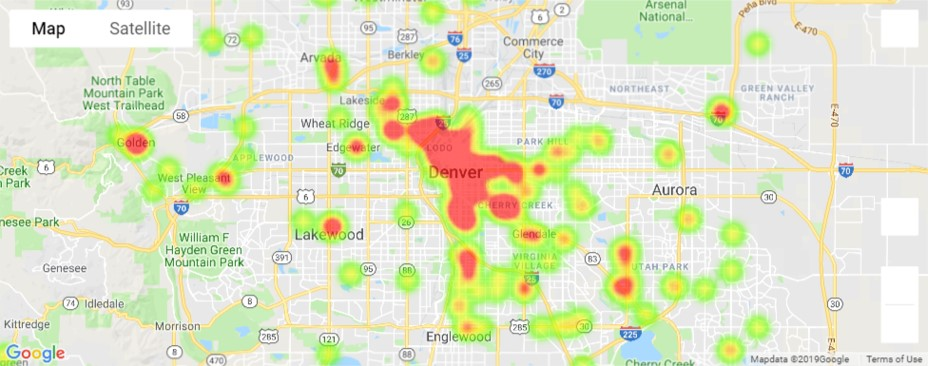

## Zomato API Project

### Goals:
- Identify top restaurants through Zomato API ranked by users and show the areas of the most popular restaurants using Google API
  - Top restaurant cuisines determined to be American, Mexican, Bar Food, Burgers and Sushi
Languages & Tools:
  - Pandas
  - Python
  - Jupyter Notebook
  - Zomato API
  - Google API
  - SeaBorn
  - Matplotlib
    

